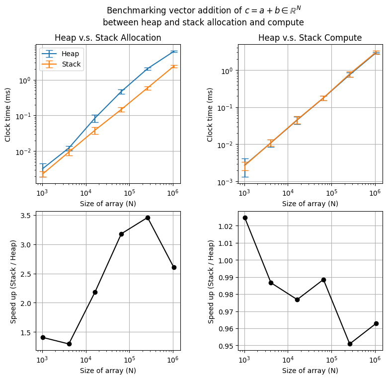

# HeapStack

HeapStack is an educational repository that benchmark allocation and computational (e.g. vector addition) speed between heap and stack allocation.

# Usage
## Compilation
We compile `serial.cpp` using
```
make
```
## Benchmarking
Next, we benchmark heap and stack allocation and vector addition of an array of sized N=2^10 to N=2^20.
We note that for array sizes less than 10000 (e.g. N=2^10,11,12) and larger than 1000 (e.g. N>2^12), we average the allocation and vector-addition time over 500000 and 1000 times.
```
./benchmark.sh
```
## Plotting rountines 
The benchmark runtimes are stored in `logs/`, and plot the results using `matplotlib`.
### Creating a python virtual environment [once]
Create a virtual environment named `heapstack`.
```
python -m venv heapstack
```
Activating the virtual environment
```
source heapstack/bin/activate
```
Installing dependencies
```
pip install -r requirements.txt
```
### Plotting benchmarking results
After the dependencies are installed/loaded, we run the plotting script by
```
python -m plots/plotbenchmark
```
The plot is found in `plots/benchmarkplot.png`


# Results

Heap v.s. Stack allocation (left) vector-addition speed (right).

1. Allocating chunks of memory on the heap takes a longer time than the stack for large arrays (e.g. N > 10^4)
2. Performing vector-addition speed is the same between arrays that are allocated on the heap and stack.

# Dependencies
```
C++
g++ 15.2.1
make 4.4.1

python
python 3.14.4 
matplotlib 3.10.8
numpy 2.4.4
```
